# 🏛️ GIAI ĐOẠN 1: Tá»”NG QUAN KIẾN TRÚC & CẤU TRÚC HỆ THỐNG

Chào mừng bạn đến với bài học đầu tiên! Trong tài liệu này, chúng ta sẽ cùng mổ xẻ kiến trúc vĩ mô của dự án **Hotel Booking Platform** mà bạn đang tiếp quản. Việc hiểu rõ mô hình vận hành và luồng dữ liệu sẽ giúp bạn tự tin đọc mã nguồn ở các bước sau mà không sợ bị lạc hướng.

---

## 1. TỔNG QUAN KIẾN TRÚC HỆ THỐNG (System Architecture)

Hệ thống được thiết kế theo mô hình **Client-Server (Khách - Chủ)** hiện đại với sự phân tách rõ ràng giữa Frontend và Backend. Cụ thể:

* **Frontend (Monorepo)**: Sử dụng cấu trúc Monorepo quản lý bằng npm workspaces. Toàn bộ mã nguồn ứng dụng client nằm trong thư mục `web`. Nó chứa 3 phân hệ ứng dụng độc lập xây dựng bằng **Vite, React và TypeScript**, chia sẻ chung các thư viện dùng chung (`api-client`, `auth-ui`).
* **Backend (RESTful API Monolith)**: Xây dựng bằng **Node.js, Express, TypeScript**, tổ chức theo kiến trúc **Domain-Driven Modules** (mỗi thư mục là một nghiệp vụ riêng).
* **Database (PostgreSQL)**: Hệ quản trị cơ sở dữ liệu quan hệ lưu giữ thông tin đặt phòng, phòng trống, khách hàng và đối tác.

### 📊 Sơ đồ Kiến trúc Tổng quan (High-Level Architecture)

```mermaid
graph TD
    subgraph Frontend Monorepo [Thư mục: web/]
        A[apps/customer <br> Khách hàng đặt phòng] 
        B[apps/partner <br> Đối tác/Khách sạn quản lý]
        C[apps/admin <br> Quản trị hệ thống]
        D[packages/api-client <br> API Client chung]
        E[packages/auth-ui <br> UI Auth chung]
        
        A --> D
        B --> D
        C --> D
        A --> E
        B --> E
    end

    subgraph Express Backend [Thư mục: backend/]
        F[backend/src/index.ts <br> HTTP Server]
        G[backend/src/middleware/ <br> CORS, Auth, Logger]
        H[backend/src/modules/ <br> Logic nghiệp vụ từng domain]
        
        D -- REST API Requests --> F
        F --> G --> H
    end

    subgraph Database Layer [Thư mục: database/]
        I[(PostgreSQL Database)]
        H -- Prisma PostgreSQL client --> I
    end

    style Frontend Monorepo fill:#e0f2fe,stroke:#0284c7,stroke-width:2px
    style Express Backend fill:#f0fdf4,stroke:#16a34a,stroke-width:2px
    style Database Layer fill:#fff7ed,stroke:#ea580c,stroke-width:2px
```

---

## 2. GIẢI THÍCH CẤU TRÚC THƯ MỤC TIÊU CHUẨN

Dưới đây là sơ đồ cấu trúc thư mục cốt lõi của dự án và ý nghĩa cụ thể của từng phần để bạn dễ dàng định vị file cần đọc:

### 📂 A. Cấu trúc Frontend Monorepo (`web/`)
Thư mục `web/` áp dụng mô hình **Monorepo** (Nhiều ứng dụng trong một Repository). Điều này cho phép 3 ứng dụng giao diện chia sẻ code logic rất tiện lợi.
* 📁 **`apps/customer`**: Ứng dụng React dành cho khách hàng tìm kiếm phòng, đặt phòng và quản lý lịch đặt phòng của mình.
* 📁 **`apps/partner`**: Ứng dụng dành cho chủ khách sạn (đối tác) đăng ký phòng, quản lý phòng trống, xem doanh thu và xác nhận đơn đặt phòng.
* 📁 **`apps/admin`**: Ứng dụng dành cho quản trị viên hệ thống để phê duyệt đối tác mới, kiểm duyệt khách sạn, xem báo cáo toàn hệ thống và xử lý tranh chấp.
* 📁 **`packages/api-client`**: SDK dùng chung do chính dự án xây dựng để đóng gói các API endpoints của backend. Nhờ đó, cả 3 app trên đều gọi API một cách thống nhất thông qua package này.
* 📁 **`packages/auth-ui`**: Chứa các component giao diện đăng ký, đăng nhập và phân quyền dùng chung.

### 📂 B. Cấu trúc Backend (`backend/`)
Thư mục `backend/` được tổ chức theo cấu trúc **Domain-Driven** rất khoa học và dễ mở rộng.
* 📁 **`src/config`**: Chứa các tệp cấu hình môi trường, thông số kết nối Database, JWT token và các biến môi trường khác.
* 📁 **`src/database`**: Nơi khởi tạo kết nối cơ sở dữ liệu (`db.ts`) và xử lý các bản vá/migration (`databaseBootstrap.ts`, `databasePatches.ts`).
* 📁 **`src/middleware`**: Các bộ lọc trung gian xử lý Request trước khi vào Logic chính:
  * Xác thực người dùng (Authentication Middleware).
  * Phân quyền (Authorization: Admin, Partner, Customer).
  * Ghi log request (Sử dụng `pino` & `pino-http`).
  * Xử lý lỗi tập trung (Global Error Handler).
* 📁 **`src/validation`**: Các schema định nghĩa kiểu dữ liệu và ràng buộc đầu vào (Sử dụng thư viện `zod`).
* 📁 **`src/modules`**: **Đây chính là Trái Tim chứa Logic nghiệp vụ cốt lõi của Backend!** Mỗi thư mục con đại diện cho một phân hệ nghiệp vụ:
  * `auth/`: Đăng nhập, đăng ký, đăng xuất, cấp quyền.
  * `hotels/`: Quản lý danh sách khách sạn, phòng, loại phòng.
  * `bookings/`: Xử lý đặt phòng, hủy phòng, trạng thái đơn hàng.
  * `payments/`: Xích nối cổng thanh toán, cập nhật trạng thái thanh toán.
  * `notifications/`: Gửi thông báo real-time tới người dùng và đối tác khi có sự kiện đặt phòng.
  * *Mỗi module sẽ chứa file định nghĩa API Route (ví dụ: `bookings.routes.ts`) và Service chứa các truy vấn SQL trực tiếp hoặc logic xử lý (ví dụ: `bookings.service.js`).*

---

## 3. LUỒNG DỮ LIỆU ĐẶT PHÒNG THỰC TẾ (Booking Data Flow)

Để giúp bạn hình dung cách các thành phần trên phối hợp với nhau, đây là sơ đồ tuần tự (Sequence Diagram) mô tả toàn bộ luồng đi từ khi khách hàng tìm kiếm cho đến lúc đặt phòng thành công:

```mermaid
sequenceDiagram
    autonumber
    actor Customer as 👤 Khách hàng
    participant AppCust as 📱 apps/customer
    participant APIClient as 📦 packages/api-client
    participant BE as ⚙️ Express Backend (bookings.routes)
    participant BEService as 🧠 Bookings Service
    participant DB as 🗄️ PostgreSQL Database
    participant PartnerApp as 🏨 apps/partner (Chủ khách sạn)

    %% 1. TÌM KIẾM PHÒNG
    Note over Customer, DB: Bước 1: Tìm kiếm & Lọc phòng trống
    Customer->>AppCust: Nhập điểm đến, Check-in, Check-out, Số khách
    AppCust->>APIClient: Gọi API lấy danh sách phòng trống
    APIClient->>BE: GET /api/hotels/available?checkIn=...&checkOut=...
    BE->>DB: Truy vấn SELECT loại phòng trống trong khoảng ngày
    DB-->>BE: Trả về danh sách RoomTypes khả dụng
    BE-->>APIClient: JSON data (Khách sạn + Loại phòng trống)
    APIClient-->>AppCust: Render UI danh sách khách sạn
    AppCust-->>Customer: Hiển thị giao diện danh sách phòng đẹp mắt

    %% 2. CHỌN PHÒNG & XEM CHI TIẾT
    Note over Customer, DB: Bước 2: Xem chi tiết & Nhập thông tin
    Customer->>AppCust: Click chọn một Khách sạn & Loại phòng cụ thể
    AppCust->>APIClient: GET /api/hotels/:id/details
    APIClient->>BE: Gọi backend lấy chi tiết giá phòng và mô tả
    BE->>DB: Query chi tiết khách sạn & các phòng thực tế
    DB-->>BE: Dữ liệu chi tiết
    BE-->>AppCust: JSON chi tiết
    AppCust-->>Customer: Hiển thị trang thanh toán và điền thông tin khách đặt

    %% 3. BẤM ĐẶT PHÒNG
    Note over Customer, DB: Bước 3: Gửi yêu cầu đặt phòng (Hành động WRITE cực kỳ quan trọng)
    Customer->>AppCust: Click "Xác nhận đặt phòng"
    AppCust->>APIClient: POST /api/bookings (Kèm checkIn, checkOut, roomTypeId)
    APIClient->>BE: POST /api/bookings Request
    
    %% 4. XỬ LÝ BACKEND (LOGIC CORE)
    rect rgb(240, 253, 244)
        Note over BE, DB: Xử lý Transaction & Lock để chống trùng lặp (Concurrency)
        BE->>BEService: Gọi hàm service đặt phòng
        BEService->>DB: Bắt đầu TRANSACTION (START TRANSACTION)
        BEService->>DB: Kiểm tra lại phòng trống & LOCK bản ghi (SELECT ... FOR UPDATE)
        alt Phòng còn trống
            BEService->>DB: INSERT INTO bookings (...)
            BEService->>DB: INSERT INTO room_occupancies (Đánh dấu phòng đã bị chiếm ngày đó)
            BEService->>DB: COMMIT TRANSACTION
            DB-->>BEService: Thành công
        else Phòng đã bị người khác đặt mất (Race Condition)
            BEService->>DB: ROLLBACK TRANSACTION
            BEService-->>BE: Ném lỗi "Room Not Available"
        end
    end

    %% 5. XÁC NHẬN & THÔNG BÁO
    alt Đặt phòng thành công
        BEService-->>BE: Trả về đối tượng Booking đã tạo
        BE-->>APIClient: HTTP 201 Created (Booking details)
        APIClient-->>AppCust: Đặt phòng thành công!
        AppCust-->>Customer: Hiển thị màn hình "Đặt phòng thành công! 🎉"
        BE-)PartnerApp: Gửi thông báo Real-time (Socket/Notification) báo có đơn đặt phòng mới
    else Thất bại
        BE-->>APIClient: HTTP 400 Bad Request / 409 Conflict
        APIClient-->>AppCust: Báo lỗi phòng đã được đặt
        AppCust-->>Customer: Hiển thị: "Rất tiếc, phòng vừa được đặt bởi khách khác."
    end
```

---

## 💡 NHỮNG FILE CỐT LÕI BẠN CẦN CHÚ Ý LÚC NÀY
Khi bắt đầu khám phá, hãy định vị ngay các file cốt lõi sau để hiểu toàn bộ logic nghiệp vụ (hãy click vào link để xem):

1. **Backend Server Setup**: [backend/src/index.ts](../backend/src/index.ts) - Nơi cấu hình Express, Middleware, kết nối cổng và khởi chạy server.
2. **Database Connector**: [backend/src/db.ts](../backend/src/db.ts) (hoặc nằm trong `src/database/db.ts`) - Cấu hình connection pool PostgreSQL.
3. **Core API Routes & Services cho Bookings**:
   * API Endpoints: [backend/src/modules/bookings/bookings.routes.ts](../backend/src/modules/bookings/bookings.routes.ts) - Nơi định nghĩa các API như POST `/`, GET `/customer`, v.v.
   * Query logic: [backend/src/modules/bookings/bookings.service.js](../backend/src/modules/bookings/bookings.service.js) - Nơi chứa truy vấn SQL kiểm tra phòng trống và ghi nhận booking vào Database.
4. **Shared API SDK**: [web/packages/api-client/](../web/packages/api-client/) - Cầu nối trung gian gọi từ Client lên Server.

---

## 🙋 CÂU HỎI THẢO LUẬN & BƯỚC TIẾP THEO

Tôi hy vọng tài liệu trực quan này đã giúp bạn hình dung được bức tranh toàn cảnh một cách sắc nét nhất!

**Để chúng ta chuyển sang Giai đoạn 2: CƠ SỞ DỮ LIỆU & MÔ HÌNH DỮ LIỆU, bạn hãy gửi cho tôi:**
1. Cấu trúc bảng (schema) trong file SQL của dự án (ví dụ file `backend/schema.sql` hoặc tệp tương đương).
2. Hoặc mô tả nhanh các bảng dữ liệu nếu bạn có sẵn.

*Tôi đang ở đây để đồng hành cùng bạn. Khi bạn sẵn sàng, hãy phản hồi và chúng ta sẽ tiến tới giai đoạn tiếp theo để giải mã cấu trúc dữ liệu!*

