# 🔍 PHÂN TÍCH CHI TIẾT LUá»’NG NGHIỆP VỤ: ADMIN DUYỆT ĐỐI TÁC (PARTNER APPROVAL FLOW)

Trong bài học này, chúng ta sẽ cùng nhau bóc tách luồng dữ liệu **End-to-End** của tính năng **Admin duyệt đối tác**. Đây là một tính năng kinh điển đại diện cho luồng CRUD và phê duyệt thông tin (Approval Flow) có phân quyền bảo mật cao.

Chúng ta sẽ đi qua 5 chặng, từ nút bấm trên giao diện cho đến câu lệnh SQL thay đổi trạng thái trong Cơ sở dữ liệu.

---

## 🗺️ BẢN ĐỒ LUỒNG ĐI CHI TIẾT (BẰNG TIẾNG VIỆT)

```mermaid
sequenceDiagram
    autonumber
    actor Admin as 👤 Quản trị viên (Giao diện)
    participant UI as 🖥️ Giao diện (PartnersTab.tsx)
    participant API as 📦 Gọi API (partnersApi.ts)
    participant Route as ⚙️ Đường dẫn API (partners.routes.ts)
    participant Auth as 🔒 Xác thực (auth.middleware.ts)
    participant DB as 🗄️ Cơ sở dữ liệu (Bảng partner_profiles)

    Admin->>UI: Click nút "Duyệt" (Icon check)
    UI->>API: Gọi hàm approvePartner(partner.id)
    API->>Route: Gửi yêu cầu POST /api/admin/partners/:id/approve
    Note over Route, Auth: Chặng 1: Kiểm tra Bảo mật & Phân quyền
    Route->>Auth: requireAdmin (Kiểm tra Cookie Session & Quyền Staff)
    Auth-->>Route: Xác thực hợp lệ
    Note over Route, DB: Chặng 2: Thực thi Nghiệp vụ trong Database
    Route->>DB: UPDATE kyc_status = 'approved' WHERE user_id = :id
    DB-->>Route: Thành công (Cập nhật thành công 1 dòng)
    Route-->>API: Phản hồi JSON { ok: true }
    API-->>UI: Cập nhật trạng thái React (React Query làm mới dữ liệu)
    UI-->>Admin: Hiển thị giao diện "Đã duyệt" màu xanh lục 🎉
```



---

## 🚀 CHI TIẾT TỪNG CHẶNG VÀ CÁC DÒNG CODE CỐT LÕI

### CHẶNG 1: GIAO DIỆN NGƯỜI DÙNG (FRONTEND UI)
Luồng bắt đầu tại giao diện Quản trị viên (Admin Dashboard) -> Tab "Đối tác".

* **Tệp tin thực tế:** [PartnersTab.tsx](../web/apps/admin/src/features/dashboard/components/tabs/PartnersTab.tsx)
* **Đường dẫn mở nhanh (Nhấp để nhảy thẳng tới dòng code):** [PartnersTab.tsx: Dòng 276](../web/apps/admin/src/features/dashboard/components/tabs/PartnersTab.tsx#L276)
* **Dòng code kích hoạt:**
  * Tại dòng 276, component hiển thị nút Duyệt đối tác dưới dạng icon màu xanh lục (`text-emerald-600`):
    ```tsx
    <Button 
      variant="ghost" 
      size="icon" 
      className="size-8 text-emerald-600 hover:bg-emerald-50" 
      onClick={onApprove} 
      disabled={isProcessing}
    >
      <Check className="size-4" />
    </Button>
    ```
  * Khi Admin click chuột vào nút này, sự kiện `onClick` sẽ kích hoạt callback `onApprove`.
  * Callback `onApprove` được truyền xuống từ component cha tại [PartnersTab.tsx: Dòng 171](../web/apps/admin/src/features/dashboard/components/tabs/PartnersTab.tsx#L171):
    ```tsx
    onApprove={() => approveMutation.mutate(partner.id)}
    ```
  * Tại đây, hệ thống sử dụng **React Query (`useMutation`)** để xử lý trạng thái bất đồng bộ (Loading, Success, Error). Biến `approveMutation` được khai báo ở [PartnersTab.tsx: Dòng 63](../web/apps/admin/src/features/dashboard/components/tabs/PartnersTab.tsx#L63):
    ```tsx
    const approveMutation = useMutation({
      mutationFn: (id: number) => approvePartner(id),
      onSuccess: () => {
        // Sau khi duyệt thành công, load lại danh sách đối tác để cập nhật UI
        queryClient.invalidateQueries({ queryKey: ['partners'] });
        toast.success("Đã duyệt đối tác thành công!");
      }
    });
    ```
  * **Giải thích chi tiết từng dòng code Frontend:**
    * `<Button onClick={onApprove}>`: Khi click, React sẽ gọi hàm `onApprove` được truyền từ cha xuống con thông qua props.
    * `approveMutation.mutate(partner.id)`: Đây là cách kích hoạt một hành động thay đổi dữ liệu (mutation) trong thư viện **React Query**. Hàm `.mutate(id)` sẽ nhận vào ID của đối tác và truyền nó cho `mutationFn`.
    * `mutationFn: (id) => approvePartner(id)`: Khai báo hàm thực thi chính. React Query sẽ lấy `id` từ lệnh mutate ở trên và gọi hàm `approvePartner(id)` (gọi API thực tế).
    * `onSuccess: () => { ... }`: Block code này **chỉ** chạy nếu hàm `approvePartner` thành công (không ném ra lỗi).
    * `queryClient.invalidateQueries({ queryKey: ['partners'] })`: Dòng code "ma thuật" của React Query! Nó đánh dấu bộ nhớ đệm (cache) mang tên `['partners']` là "đã cũ". Ngay lập tức, React Query sẽ tự động ngầm gửi một request GET lên server để lấy danh sách đối tác mới nhất và cập nhật lại giao diện (đổi màu xanh thành trạng thái Đã duyệt) mà người dùng **không cần phải F5 lại trang**.

---

### CHẶNG 2: LỚP GIAO TIẾP API (API CLIENT)
Hàm `approvePartner` là cầu nối gửi yêu cầu HTTP từ trình duyệt lên máy chủ.

* **Tệp tin thực tế:** [partnersApi.ts](../web/apps/admin/src/api/partnersApi.ts)
* **Đường dẫn mở nhanh (Nhấp để nhảy thẳng tới dòng code):** [partnersApi.ts: Dòng 29](../web/apps/admin/src/api/partnersApi.ts#L29)
* **Dòng code kích hoạt:** (Dòng 29-31)
  ```typescript
  export const approvePartner = async (id: number) => {
    return await api(`/admin/partners/${id}/approve`, { method: "POST" });
  };
  ```
  * **Giải thích chi tiết từng dòng code API Client:**
    * `export const approvePartner`: Xuất hàm này ra để các component React (như `PartnersTab.tsx`) có thể `import` và sử dụng.
    * `async (id: number)`: Khai báo đây là một hàm bất đồng bộ (sẽ mất thời gian chờ server phản hồi), nhận vào một số nguyên là `id` của đối tác.
    * `` api(`/admin/partners/${id}/approve`, ...) ``: Gọi một hàm wrapper tên là `api` (được định nghĩa riêng trong dự án). Ký tự backtick `` ` `` giúp truyền biến `${id}` trực tiếp vào chuỗi URL, tạo thành đường dẫn ví dụ: `/admin/partners/5/approve`.
    * `{ method: "POST" }`: Định nghĩa phương thức HTTP là POST, báo cho server biết đây là hành động tạo/cập nhật dữ liệu chứ không phải chỉ lấy dữ liệu (GET). Hàm `api` này sẽ ngầm định tự động đính kèm các Cookie xác thực của Admin vào Request để server kiểm tra.

---

### CHẶNG 3: BỘ LỌC BẢO MẬT & PHÂN QUYỀN (BACKEND MIDDLEWARE)
Trước khi nghiệp vụ được thực thi, máy chủ phải bảo đảm người gửi yêu cầu thực sự là **Admin** hợp pháp.

* **Tệp tin thực tế:** [auth.middleware.ts](../backend/src/modules/auth/auth.middleware.ts)
* **Đường dẫn mở nhanh (Nhấp để nhảy thẳng tới dòng code):** [auth.middleware.ts: Dòng 82](../backend/src/modules/auth/auth.middleware.ts#L82)
* **Dòng code kích hoạt:** (Dòng 82-94)
  ```typescript
  export async function requireAdmin(req: Request, res: Response, next: NextFunction): Promise<any> {
    try {
      const s = await loadVerifiedSession(req.cookies?.["session_admin"])
             || await loadVerifiedSession(req.cookies?.["session"]);
      if (!s) {
        clearAuthCookie(res, "admin");
        return res.status(401).json({ error: "Phiên đăng nhập không hợp lệ hoặc đã hết hạn" });
      }
      if (s.role !== "admin") return res.status(403).json({ error: "Không có quyền" });
      req.session = s;
      next(); // Vượt qua vòng bảo mật, đi tiếp vào controller nghiệp vụ
    } catch (e) { next(e); }
  }
  ```
  * **Giải thích chi tiết từng dòng code Middleware:**
    * `req, res, next`: Ba tham số mặc định của mọi middleware trong Express.js. `req` là yêu cầu từ client gửi lên, `res` là đối tượng để trả kết quả về, `next` là hàm để báo hiệu "đã kiểm tra xong, hãy chạy đoạn code tiếp theo".
    * `req.cookies?.["session_admin"]`: Dấu `?.` (Optional Chaining) giúp chống lỗi sập server nếu biến `req.cookies` bị undefined (không có cookie nào). Nó sẽ cố đọc cookie mang tên `session_admin`.
    * `await loadVerifiedSession(...)`: Hàm này sẽ giải mã Cookie, kiểm tra chữ ký bảo mật (JWT) và đối chiếu với database xem tài khoản này có bị khóa (banned) hay không.
    * `if (!s) return res.status(401)...`: Nếu hàm trên trả về rỗng (tức là cookie hết hạn, giả mạo, hoặc tài khoản bị khóa), middleware lập tức ngắt luồng, trả về mã lỗi HTTP 401 (Unauthorized - Chưa xác thực). Lệnh `return` đảm bảo code bên dưới không bị chạy tiếp.
    * `if (s.role !== "admin") return res.status(403)...`: Nếu có đăng nhập hợp lệ nhưng role (vai trò) không phải là `admin` (ví dụ: customer lấy cookie của mình gửi lên), sẽ bị chặn và trả về lỗi 403 (Forbidden - Cấm truy cập).
    * `req.session = s;`: Gắn thông tin tài khoản hợp lệ (gồm `userId` và `role`) vào biến `req`. Nhờ dòng này, các hàm phía sau có thể dễ dàng biết ai đang thực hiện hành động.
    * `next();`: Dòng quan trọng nhất của middleware thành công. Gọi hàm này để báo cho Express chuyển yêu cầu (request) đi qua chốt gác bảo mật, tiến vào hàm xử lý nghiệp vụ chính.

---

### CHẶNG 4: ĐƯỜNG DẪN & XỬ LÝ NGHIỆP VỤ (BACKEND ROUTE & CONTROLLER)
Khi request an toàn đi qua Middleware, Backend sẽ định tuyến và xử lý nghiệp vụ phê duyệt đối tác.

* **Tệp tin thực tế:** [partners.routes.ts](../backend/src/modules/partners/partners.routes.ts)
* **Đường dẫn mở nhanh (Nhấp để nhảy thẳng tới dòng code):** [partners.routes.ts: Dòng 60](../backend/src/modules/partners/partners.routes.ts#L60)
* **Dòng code kích hoạt:** (Dòng 60-68)
  ```typescript
  router.post("/admin/partners/:id/approve", requireAdmin, async (req: Request, res: Response, next: NextFunction) => {
    try {
      await pool.query(
        "UPDATE partner_profiles SET kyc_status = 'approved', reject_reason = NULL WHERE user_id = ?",
        [req.params.id]
      );
      res.json({ ok: true });
    } catch (e) { next(e); }
  });
  ```
  * **Giải thích chi tiết từng dòng code Controller:**
    * `router.post("/admin/partners/:id/approve", requireAdmin, async (...) => {...})`: Khai báo một đường dẫn API. Nó quy định 3 thứ: (1) Phương thức là POST, (2) Nếu URL khớp với mẫu có tham số động `:id`, (3) Phải đi qua chốt gác `requireAdmin` trước khi chạy hàm `async`.
    * `req.params.id`: Trích xuất cái ID mà frontend gửi lên trong URL. Ví dụ URL là `/admin/partners/15/approve`, thì `req.params.id` sẽ mang giá trị `"15"`.
    * `await pool.query(...)`: Lấy một kết nối từ "Hồ chứa kết nối" (Connection Pool) của PostgreSQL và yêu cầu nó chạy câu lệnh SQL. Lệnh `await` bắt server chờ cho đến khi PostgreSQL thực thi xong mới chạy tiếp.
    * `[req.params.id]`: Mảng này chứa các giá trị sẽ được nhét vào vị trí dấu `?` trong câu SQL ở trên. Việc dùng dấu `?` và truyền tham số qua mảng thế này được gọi là "Prepared Statement", giúp **chống lại các cuộc tấn công SQL Injection** (Tin tặc không thể tiêm mã độc vào `req.params.id` để phá DB).
    * `res.json({ ok: true });`: Lệnh cuối cùng trả về cho Frontend một phản hồi (Response) dạng chuỗi JSON báo hiệu mọi thứ đã thành công tốt đẹp. Lúc này frontend sẽ nhận được {ok: true} và chạy block `onSuccess` để làm mới màn hình.

---

### CHẶNG 5: CẬP NHẬT CƠ SỞ DỮ LIỆU (DATABASE LAYER)
Hành động cuối cùng diễn ra trong hệ quản trị cơ sở dữ liệu PostgreSQL:

```sql
UPDATE partner_profiles 
   SET kyc_status = 'approved', 
       reject_reason = NULL 
 WHERE user_id = ?;
```
* **Giải thích ý nghĩa nghiệp vụ của dữ liệu:**
  1. `kyc_status = 'approved'`: Đánh dấu trạng thái kiểm duyệt hồ sơ KYC đối tác đã thành công. Từ thời điểm này trở đi, tài khoản đối tác có thể đăng nhập vào phân hệ `apps/partner` để đăng bài và quản lý khách sạn của họ.
  2. `reject_reason = NULL`: Xoá bỏ lý do từ chối trước đó (nếu có) để hồ sơ sạch sẽ.
  3. `WHERE user_id = ?`: Ràng buộc chính xác đối tác cần duyệt theo ID được truyền lên từ URL của frontend.

---

## 💡 TƯ DUY THIẾT KẾ CỦA HỆ THỐNG NÀY (Key Takeaways)

1. **Phân quyền chặt chẽ thông qua Cookie & Session**: Logic kiểm tra cookie được đóng gói gọn gàng thành một Middleware (`requireAdmin`). Bạn chỉ cần khai báo middleware này đứng trước Controller (ở dòng 60) là endpoint đó đã được bảo vệ tuyệt đối.
2. **Quản lý state bất đồng bộ thông minh bằng React Query**: Ở Frontend, thay vì viết code thủ công quản lý trạng thái loading, error hay re-fetch dữ liệu, hệ thống sử dụng React Query (`useMutation`). Lợi ích lớn nhất là sau khi API approve thành công, hàm `invalidateQueries(['partners'])` sẽ tự động kích hoạt lấy lại danh sách đối tác mới nhất giúp UI luôn đồng bộ mà không cần tải lại trang.
3. **Database tối giản, hiệu quả**: Trạng thái KYC của đối tác được tách ra bảng `partner_profiles` thay vì gộp chung vào bảng `users`. Điều này giúp bảng `users` luôn nhẹ nhàng, tối ưu tốc độ đọc khi đăng nhập hệ thống nói chung.

