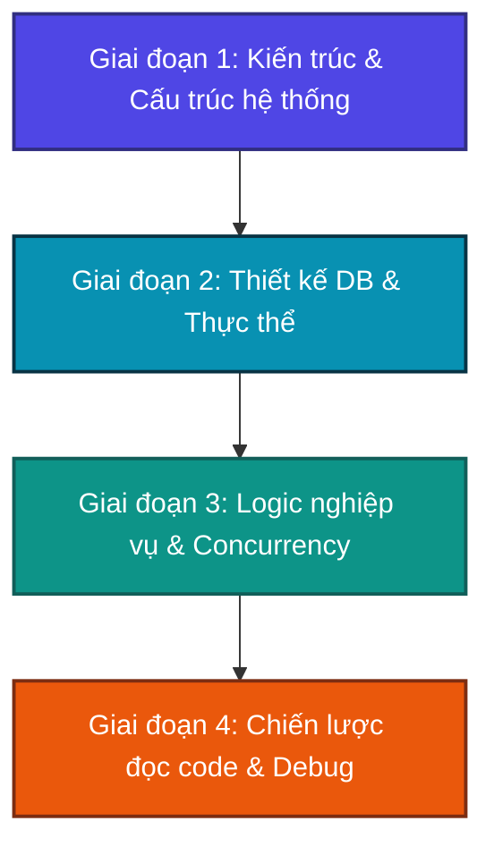

# 🗺️ PROJECT MASTER PLAN: LỘ TRÌNH LÀM CHỦ HỆ THỐNG ĐẶT PHÒNG KHÁCH SẠN

Chào bạn! Với vai trò là một **Kỹ sư phần mềm trưởng (Lead Software Engineer)** và là người cố vấn kỹ thuật của bạn, tôi rất vui mừng được đồng hành cùng bạn trong hành trình chinh phục dự án **Hotel Booking Platform** này. 

Việc tiếp quản một dự án đã hoàn thiện (hoặc phần lớn) là một cơ hội tuyệt vời để nâng cao tư duy thiết kế hệ thống, đọc hiểu code và học hỏi cách giải quyết các bài toán nghiệp vụ phức tạp. Thay vì đi thẳng vào code và bị "ngợp" bởi hàng nghìn dòng lệnh, chúng ta sẽ tiếp cận một cách **bài bản, khoa học** đi từ **Tổng quan (Vĩ mô) -> Chi tiết (Vi mô)**.

Dưới đây là Lộ trình Master Plan 4 giai đoạn tôi thiết kế riêng cho bạn để làm chủ hoàn toàn dự án này.

---

## 📅 LỘ TRÌNH 4 GIAI ĐOẠN LÀM CHỦ DỰ ÁN (PROJECT MASTER PLAN)

### 🔹 GIAI ĐOẠN 1: TỔNG QUAN KIẾN TRÚC & CẤU TRÚC THƯ MỤC
* **Mục tiêu**: Hiểu được cấu trúc thư mục thực tế của dự án, sự phân tách giữa Backend (Node.js/Express) và Frontend (Monorepo Vite/React với 3 phân hệ Admin, Customer, Partner). Nắm vững luồng đi của dữ liệu (Data Flow) khi khách đặt phòng.
* **Chi tiết tài liệu**: Đọc tài liệu chi tiết tại [01_overview_architecture.md](./01_overview_architecture.md).
* **Trạng thái**: 🟢 **ĐÃ SẴN SÀNG (Đọc ngay)**

### 🔹 GIAI ĐOẠN 2: CƠ SỞ DỮ LIỆU & MÔ HÌNH DỮ LIỆU
* **Mục tiêu**: Đọc hiểu schema SQL, phân tích 5 thực thể cốt lõi (`User`, `Hotel`, `RoomType`, `Room`, `Booking`) và các mối quan hệ 1-n, n-n. Hiểu cách lưu trữ trạng thái phòng trống.
* **Chi tiết tài liệu**: Sẽ được biên soạn tại [02_database_models.md](./02_database_models.md) sau khi bạn gửi cấu trúc database hoặc schema thực tế.
* **Trạng thái**: 🟡 **ĐANG CHỜ (Chờ schema từ bạn)**

### 🔹 GIAI AN 3: LUỒNG LOGIC CORE & BÀI TOÁN KHÓ (OVERBOOKING)
* **Mục tiêu**:
  1. Phân tích chi tiết thuật toán kiểm tra phòng trống (Room Availability) trong một khoảng thời gian `[CheckIn, CheckOut]`.
  2. Phân tích các giải pháp chống đặt trùng phòng (Concurrency/Overbooking) ở tầng Database (Pessimistic / Optimistic Locking) và Application (Transactions).
* **Chi tiết tài liệu**: Sẽ được biên soạn tại [03_core_business_logic.md](./03_core_business_logic.md).
* **Trạng thái**: ⚪ **CHƯA BẮT ĐẦU**

### 🔹 GIAI ĐOẠN 4: CHIẾN LƯỢC TIẾP CẬN VÀ ĐỌC CODE
* **Mục tiêu**: Lập sơ đồ thứ tự các file nên đọc trong dự án này từ Config -> Database -> Repositories -> Services -> API Controllers -> Frontend Views. Hướng dẫn cách đặt breakpoint debug để theo dõi luồng chạy thực tế.
* **Chi tiết tài liệu**: Sẽ được biên soạn tại [04_code_reading_strategy.md](./04_code_reading_strategy.md).
* **Trạng thái**: ⚪ **CHƯA BẮT ĐẦU**

---

## 🛠️ PHƯƠNG PHÁP HỌC CHỦ ĐỘNG (ACTIVE LEARNING METHOD)
Để đạt hiệu quả tối đa khi làm việc cùng tôi, bạn hãy áp dụng phương pháp sau:
1. **Đọc tài liệu lý thuyết & sơ đồ** tôi cung cấp ở mỗi bước.
2. **Đối chiếu trực tiếp** với code thực tế trong workspace của bạn (bật song song hai cửa sổ IDE).
3. **Thực hành đặt câu hỏi "Tại sao?"**: Ví dụ: *Tại sao tác giả lại tách RoomType và Room riêng biệt?* hoặc *Tại sao lại dùng transaction ở API này mà API khác lại không cần?*
4. **Viết mã chạy thử / Debug**: Tôi sẽ chỉ cho bạn chính xác các file test hoặc các API endpoint để bạn "gọi thử" (qua Postman hoặc cURL) nhằm kiểm chứng logic lý thuyết.

---

### 👉 BƯỚC TIẾP THEO:
Hãy mở file tiếp theo: **[01_overview_architecture.md](./01_overview_architecture.md)** để bắt đầu học **Giai đoạn 1: Tổng quan Kiến trúc và Luồng dữ liệu**. Tôi đã thiết kế tài liệu này cực kỳ trực quan với sơ đồ Mermaid và phân tích chi tiết dựa trên chính công nghệ thực tế đang chạy trong project của bạn.
